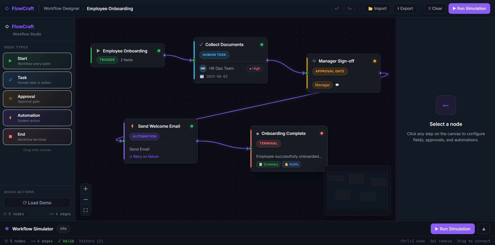
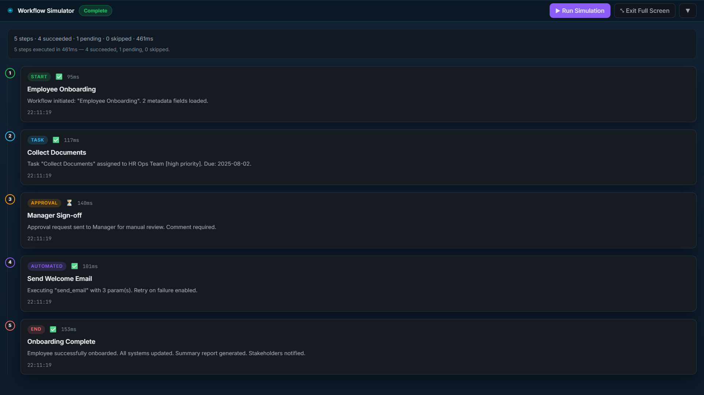

# FlowCraft — HR Workflow Designer

[](https://github.com/Kesavaraja67/flow-chart/actions)
[](https://github.com/Kesavaraja67/flow-chart)
[](./package.json)



FlowCraft is a visual HR workflow designer for building, validating, and simulating onboarding and approval flows on an infinite canvas.

## Key Features

- Drag-and-drop workflow builder with custom node types.
- Typed step configuration forms for consistent setup.
- Built-in workflow validation before execution.
- Step-by-step simulation with duration-aware timeline logs.
- Undo/redo history, JSON import/export, and keyboard shortcuts.

## Workflow Demo

See how each step runs in sequence with execution timing and simulation logs.



## Quick Start

```bash
git clone https://github.com/Kesavaraja67/flow-chart.git
cd flow-chart
npm install
npm run dev
```
